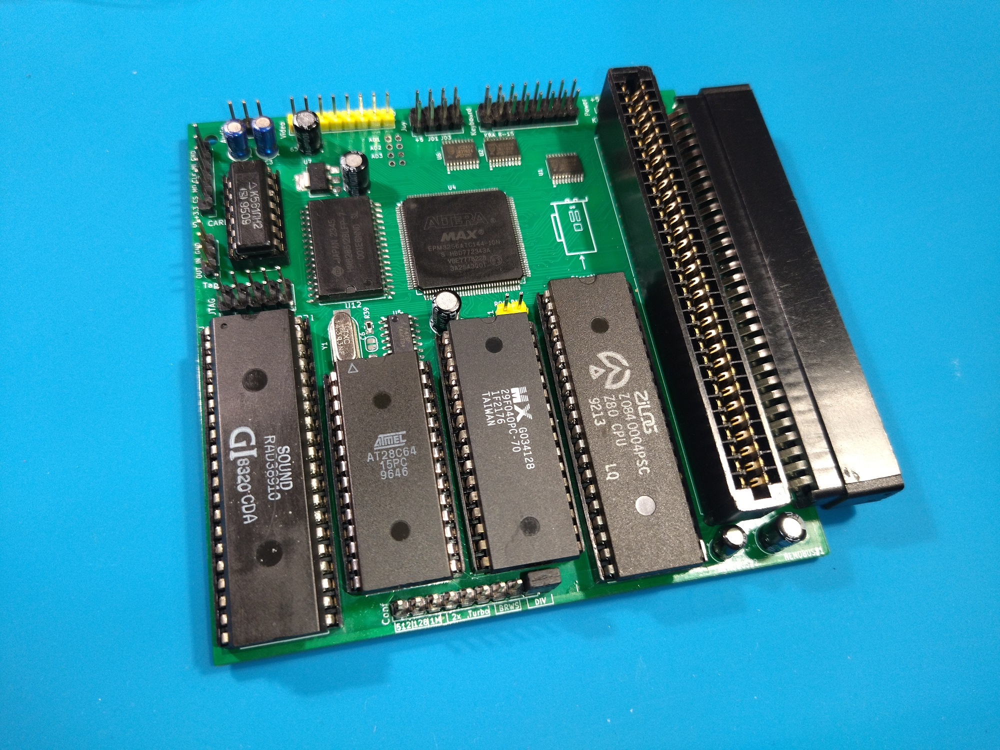

ZX Spectrum (Pentagon128) compatible computer with expansion slots and built-in DivMMC.
RAM size 128, 512, 1024kb.
Processor speed 3.5 MHz or 7 MHz.
Two expansion slots.
Unbuffered RGBI video output for AlecEkb encoder.

